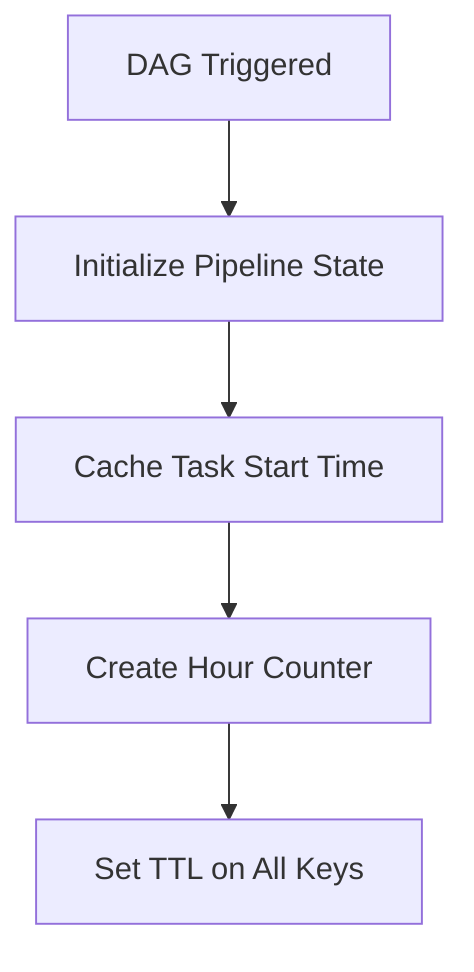
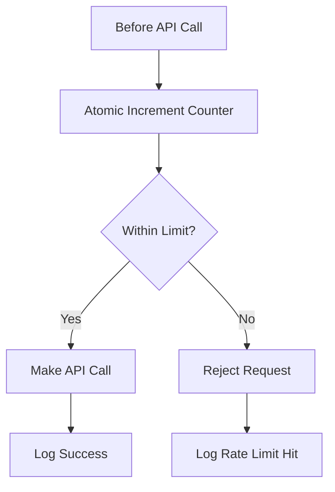
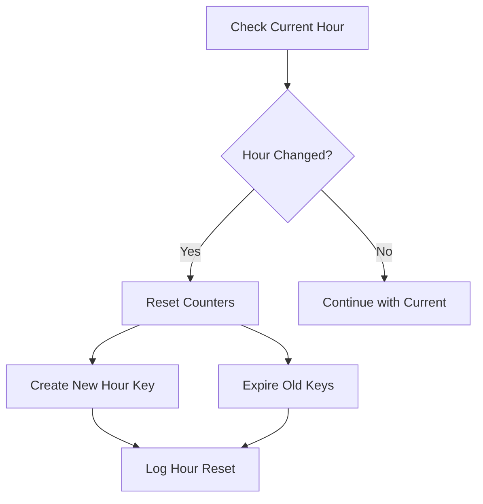
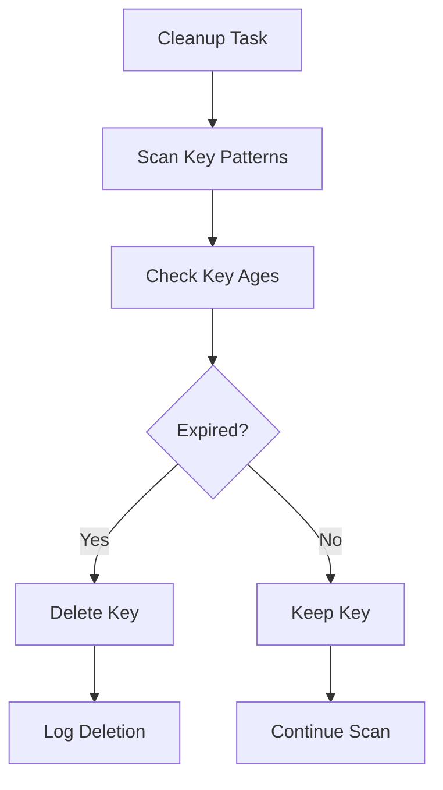

# Redis Data Schema and Key Patterns

This document describes the Redis data schema used by the CourtListener Pipeline for distributed rate limiting, state management, and pipeline coordination.

## Overview

The pipeline uses Redis as a centralized cache for:
- **Distributed Rate Limiting**: Tracking API calls across multiple worker nodes
- **Pipeline State Management**: Coordinating DAG execution state
- **Task Timing**: Caching task start times for monitoring
- **Failure Tracking**: Recording failed dockets for retry logic

## Key Naming Conventions

All Redis keys follow a hierarchical naming pattern:
```
courtlistener:{category}:{identifier}
```

### Key Categories

| Category | Purpose | TTL | Example |
|----------|---------|-----|---------|
| `rate_limit` | API rate limiting counters | 2 hours | `courtlistener:rate_limit:2024-09-17_14` |
| `pipeline` | DAG run state tracking | 25 hours | `courtlistener:pipeline:manual_2024-09-17T14:30:00+00:00` |
| `task_start` | Task start time caching | 25 hours | `courtlistener:task_start:manual_2024-09-17T14:30:00+00:00:process_docket` |
| `counter` | Hour-based API call counters | 2 hours | `courtlistener:counter:2024-09-17_14` |
| `failed` | Failed docket tracking | 2 hours | `courtlistener:failed:2024-09-17_14` |

## Key Patterns and Data Structures

### 1. Rate Limiting Keys

#### Pattern: `courtlistener:rate_limit:{hour_key}`
- **Purpose**: Track API calls for distributed rate limiting
- **Data Type**: Integer (Redis STRING)
- **TTL**: 2 hours (configurable via `REDIS_COUNTER_TTL_HOURS`)
- **Format**: `YYYY-MM-DD_HH` (UTC time)

**Example**:
```redis
KEY: courtlistener:rate_limit:2024-09-17_14
VALUE: 1247
TTL: 7200 seconds
```

**Operations**:
- `INCR` - Atomic increment for each API call
- `GET` - Check current usage
- `EXPIRE` - Set TTL on creation

### 2. Counter Keys

#### Pattern: `courtlistener:counter:{hour_key}`
- **Purpose**: Alternative counter implementation for fallback scenarios
- **Data Type**: Integer (Redis STRING)
- **TTL**: 2 hours (configurable)

**Lua Script Operations**:
```lua
-- Atomic increment with limit checking
local key = KEYS[1]
local increment = tonumber(ARGV[1])
local limit = tonumber(ARGV[2])
local ttl = tonumber(ARGV[3])

local current = redis.call('GET', key) or 0
current = tonumber(current)

if current + increment <= limit then
    local new_count = redis.call('INCRBY', key, increment)
    redis.call('EXPIRE', key, ttl)
    return {new_count, 1}  -- {count, allowed}
else
    return {current, 0}    -- {count, rejected}
end
```

### 3. Pipeline State Keys

#### Pattern: `courtlistener:pipeline:{dag_run_id}`
- **Purpose**: Store comprehensive DAG run state
- **Data Type**: Hash (Redis HASH)
- **TTL**: 25 hours (configurable via `REDIS_STATE_TTL_HOURS`)

**Hash Fields**:
```redis
HSET courtlistener:pipeline:manual_2024-09-17T14:30:00+00:00
  dag_run_id "manual_2024-09-17T14:30:00+00:00"
  start_time "2024-09-17T14:30:00.123456"
  current_hour "2024-09-17_14"
  api_calls_this_hour "1247"
  status "running"
  dockets_processed "['12345', '12346', '12347']"
  redis_keys "{'state_key': '...', 'counter_key': '...', 'failed_key': '...'}"
```

**State Management Operations**:
```python
# Initialize pipeline state
redis_hook.initialize_pipeline_state(dag_run_id, ttl_hours=25)

# Update pipeline state
redis_hook.update_pipeline_state(
    dag_run_id=dag_run_id,
    status="processing",
    dockets_processed=processed_list
)
```

### 4. Task Start Time Keys

#### Pattern: `courtlistener:task_start:{dag_run_id}:{task_id}`
- **Purpose**: Cache task start times for performance monitoring
- **Data Type**: String (ISO timestamp)
- **TTL**: 25 hours

**Example**:
```redis
KEY: courtlistener:task_start:manual_2024-09-17T14:30:00+00:00:process_docket_123
VALUE: "2024-09-17T14:35:22.456789"
TTL: 90000 seconds
```

### 5. Failed Dockets Keys

#### Pattern: `courtlistener:failed:{hour_key}`
- **Purpose**: Track failed dockets for retry and monitoring
- **Data Type**: List (Redis LIST)
- **TTL**: 2 hours

**Operations**:
```redis
LPUSH courtlistener:failed:2024-09-17_14 "12345"
LPUSH courtlistener:failed:2024-09-17_14 "12346"
LRANGE courtlistener:failed:2024-09-17_14 0 -1  # Get all failed dockets
```

## Hour Key Format

All time-based keys use a standardized hour format:

```python
def get_hour_key() -> str:
    """Generate hour key in format YYYY-MM-DD_HH"""
    return datetime.utcnow().strftime("%Y-%m-%d_%H")
```

**Examples**:
- `2024-09-17_14` (2:00-2:59 PM UTC on Sept 17, 2024)
- `2024-12-31_23` (11:00-11:59 PM UTC on Dec 31, 2024)

## Atomic Operations

### Rate Limit Increment

The pipeline uses Lua scripts for atomic rate limiting operations:

```lua
-- ATOMIC_INCREMENT_SCRIPT
local key = KEYS[1]
local increment = tonumber(ARGV[1])
local limit = tonumber(ARGV[2])
local ttl = tonumber(ARGV[3])

local current = redis.call('GET', key) or 0
current = tonumber(current)

if current + increment <= limit then
    local new_count = redis.call('INCRBY', key, increment)
    redis.call('EXPIRE', key, ttl)
    return {new_count, 1}
else
    return {current, 0}
end
```

### Pipeline State Update

```lua
-- ATOMIC_STATE_UPDATE_SCRIPT
local state_key = KEYS[1]
local field = ARGV[1]
local value = ARGV[2]
local ttl = tonumber(ARGV[3])

redis.call('HSET', state_key, field, value)
redis.call('EXPIRE', state_key, ttl)
return redis.call('HGETALL', state_key)
```

## Configuration Parameters

### Environment Variables

| Variable | Default | Description |
|----------|---------|-------------|
| `REDIS_COUNTER_TTL_HOURS` | 2 | TTL for rate limiting counters |
| `REDIS_STATE_TTL_HOURS` | 25 | TTL for pipeline state data |
| `COURTLISTENER_SAFETY_BUFFER` | 25 | Safety buffer for rate limits |
| `CALL_LIMIT_PER_HOUR` | 5000 | Maximum API calls per hour |

### Redis Connection

```python
# Connection parameters
REDIS_CONN_ID = "redis_default"  # Airflow connection ID
DEFAULT_HOST = "localhost"
DEFAULT_PORT = 6379
DEFAULT_DB = 0
```

## Data Lifecycle

### 1. Pipeline Start


### 2. API Call Tracking


### 3. Hour Boundary Handling


### 4. Cleanup Process


## Monitoring and Metrics

### Key Metrics Tracked

1. **Connection Metrics**:
   - Connection attempts/failures
   - Success rates
   - Consecutive failures

2. **Operation Metrics**:
   - Total operations performed
   - Operation failures
   - Operation success rates

3. **Performance Metrics**:
   - Average response times
   - Peak usage periods
   - Memory utilization

### Health Checks

```python
# Check Redis connection health
def is_connection_healthy() -> bool:
    return not redis_metrics.is_unhealthy()

# Get comprehensive metrics
def get_connection_metrics() -> dict:
    return {
        'connection_attempts': metrics.connection_attempts,
        'connection_failures': metrics.connection_failures,
        'success_rate': metrics.calculate_success_rate(),
        'consecutive_failures': metrics.consecutive_failures
    }
```

## Troubleshooting

### Common Issues

1. **Key Not Found Errors**:
   - Check TTL settings
   - Verify hour key format
   - Confirm Redis connection

2. **Rate Limit False Positives**:
   - Check system clock synchronization
   - Verify hour boundary logic
   - Review safety buffer settings

3. **Memory Issues**:
   - Run cleanup task more frequently
   - Reduce TTL values if appropriate
   - Monitor Redis memory usage

### Debugging Commands

```bash
# Check specific key
redis-cli GET "courtlistener:rate_limit:2024-09-17_14"

# List all pipeline keys
redis-cli KEYS "courtlistener:*"

# Check key TTL
redis-cli TTL "courtlistener:pipeline:manual_2024-09-17T14:30:00+00:00"

# Monitor Redis operations
redis-cli MONITOR
```

## Best Practices

1. **Key Naming**: Always use the standardized prefix format
2. **TTL Management**: Set appropriate TTLs to prevent memory leaks
3. **Atomic Operations**: Use Lua scripts for complex operations
4. **Error Handling**: Implement fallbacks for Redis unavailability
5. **Monitoring**: Track metrics for proactive issue detection
6. **Cleanup**: Regular cleanup of expired keys
7. **Documentation**: Keep this schema documentation updated

## Schema Version

- **Version**: 1.0
- **Last Updated**: 2024-09-17
- **Compatibility**: Redis 6.0+
- **Related Components**:
  - `airflow/hooks/redis_rate_limit_hook.py`
  - `airflow/dags/courtlistener_pipeline_dag.py`